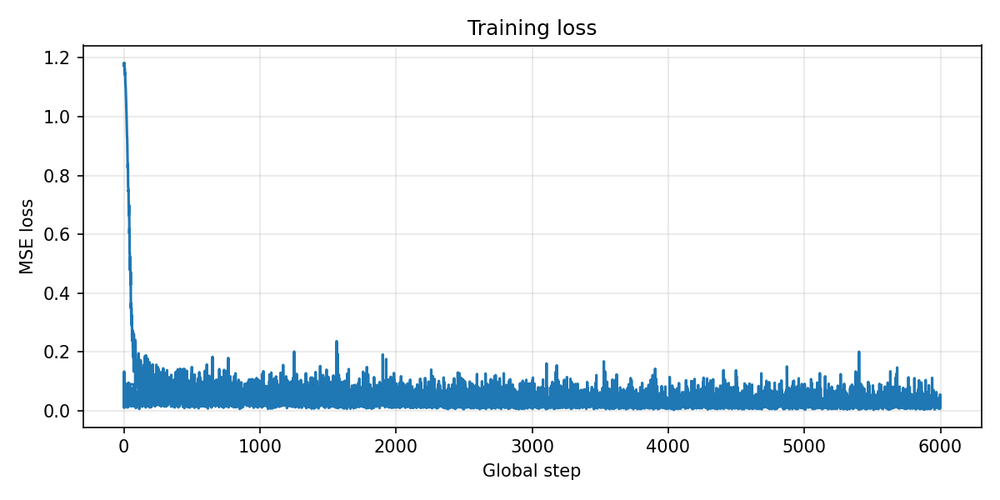
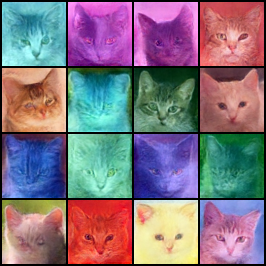
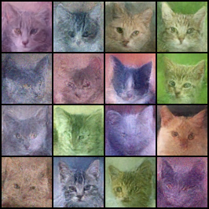

# Обучение диффузионной модели на датасете котов

## Выбранный датасет

Используется датасет [huggan/few-shot-cat](https://huggingface.co/datasets/huggan/few-shot-cat): `train`, 160 RGB-изображений 256x256. При обучении изображения приводятся к 64x64, центрируются/обрезаются, случайно отражаются по горизонтали и нормализуются в диапазон `[-1, 1]`.

## Архитектура модели

- Модель: `diffusers.UNet2DModel`
- Разрешение: 64x64
- Каналы: RGB, `in_channels=3`, `out_channels=3`
- Блоки UNet: `[64, 128, 128, 256]`
- Attention: один down/up attention-блок на среднем уровне
- Диффузия: 1000 train timesteps
- Noise schedule: `squaredcos_cap_v2`
- Цель обучения: MSE между предсказанным шумом и настоящим добавленным шумом

## Запуск

Создать окружение и установить зависимости:

```bash
python -m venv .venv
source .venv/bin/activate
pip install -r requirements.txt
```

Запуск обучения:

```bash
python train.py --config config.yaml
```

Запуск генерации DDPM:

```bash
python sample.py --checkpoint checkpoints/final --method ddpm --steps 1000 --num-images 16 --output samples/ddpm_1000.png
```

Запуск генерации DDIM:

```bash
python sample.py --checkpoint checkpoints/final --method ddim --steps 100 --num-images 16 --output samples/ddim_100.png
```

Запуск сравнения DDPM и DDIM одной командой:

```bash
python benchmark.py --checkpoint checkpoints/final --num-images 16 --ddpm-steps 1000 --ddim-steps 100
```


## Параметры обучения

Параметры по умолчанию находятся в `config.yaml`:

- Датасет: `huggan/few-shot-cat`
- Разрешение: 64x64
- Batch size: 16
- Epochs: 300
- Learning rate: `1e-4`
- Train timesteps: 1000
- EMA: включена для более стабильной генерации
- Validation: каждые 25 эпох
- Checkpoints: каждые 50 эпох и финальный `checkpoints/final`

## Результаты

После обучения появляются файлы:

- `outputs/loss.csv` - лог loss по шагам
- `outputs/loss.png` - график loss
- `outputs/validation_epoch_XXXX.png` - сетки сгенерированных изображений во время обучения
- `outputs/sampling_benchmark.csv` - замеры времени DDPM/DDIM после запуска `benchmark.py`
- `checkpoints/final` - финальный чекпоинт модели и scheduler
- `samples/*.png` - результаты генерации из `sample.py`

Лосс обучения:



Примеры генерации:





## Сравнение DDPM и DDIM

Скрипт `sample.py` печатает время генерации:

```text
method=ddpm
steps=1000
num_images=16
device=cuda/mps/cpu
elapsed_sec=...
sec_per_image=...
saved=samples/ddpm_1000.png
```

```text
method=ddim
steps=100
num_images=16
device=cuda/mps/cpu
elapsed_sec=...
sec_per_image=...
saved=samples/ddim_100.png
```

Таблица сравнения времени DDPM и DDIM и субъективная оценка качества:

| Метод | Шаги | Время, сек | Сек/изображение | Качество |
| --- | ---: | ---: | ---: | --- |
| DDPM | 1000 | 303 | 19 | Хорошее |
| DDIM | 100 | 29 | 1.8 | Хуже чум DDPM |


## Выводы

В работе реализован полный цикл: загрузка и предобработка изображений, добавление шума, обучение UNet на MSE loss, сохранение чекпоинтов, валидационная генерация и отдельный sampling-скрипт для DDPM/DDIM.

## Демо

Демо видео: [ссылка](https://disk.360.yandex.ru/i/0p27_EvgwgF48A)